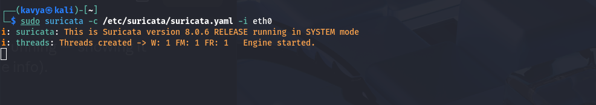
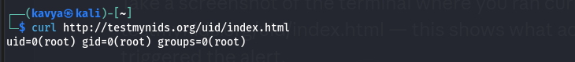
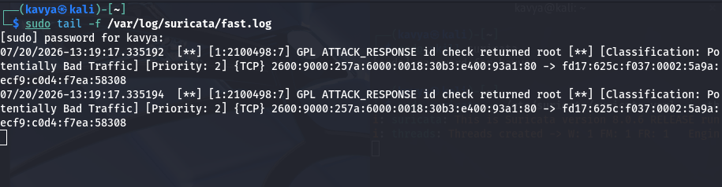
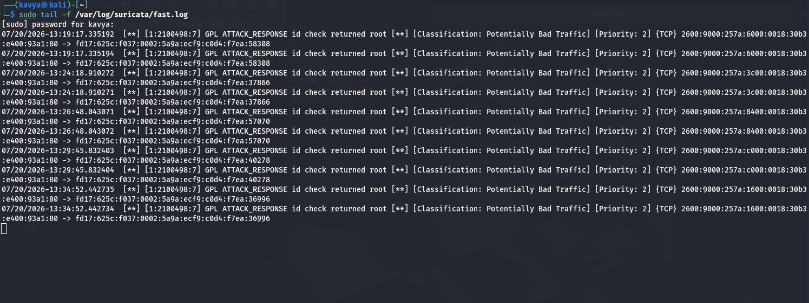
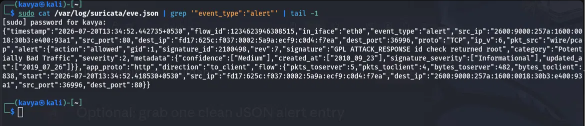

# Task 4 - Network Intrusion Detection System

Set up a network based IDS to detect suspicious traffic and generate alerts.

## Tools
- Suricata
- Kali Linux (VirtualBox)

Went with Suricata over Snort since it logs alerts in JSON (eve.json), 
which is more structured than plain text logs.

## Steps
1. Installed Suricata - `sudo apt install suricata -y`
2. Checked it installed correctly - `suricata --build-info`
3. Checked config at `/etc/suricata/suricata.yaml`, confirmed HOME_NET and 
interface (eth0) were correct
4. Updated rules - `sudo suricata-update`
5. Ran Suricata on the interface - `sudo suricata -c /etc/suricata/suricata.yaml -i eth0`
6. Watched for alerts in another terminal - `sudo tail -f /var/log/suricata/fast.log`



## Testing it actually works
Normal browsing/pinging doesn't look suspicious, so nothing was triggering 
alerts by default. Used testmynids.org, which is a standard safe test site 
made for testing IDS/IPS setups - it returns text that matches a default 
detection rule.

```
curl http://testmynids.org/uid/index.html
```



This triggered a real alert in fast.log:




## Checking the structured log (eve.json)
Suricata also logs the same alert in JSON format, which has more detail and 
is meant to be used by dashboard tools rather than read directly.

```
sudo cat /var/log/suricata/eve.json | grep '"event_type":"alert"' | tail -1
```



The JSON showed the exact rule that matched (`GPL ATTACK_RESPONSE id check 
returned root`), and that the action was "allowed" - meaning Suricata only 
detected and logged it, didn't block it, since this is IDS not IPS.

## What I learned
- An IDS doesn't just show traffic like a sniffer does, it compares packets 
against a list of rules and flags matches
- Suricata logs alerts in two formats - fast.log (readable) and eve.json 
(structured, for dashboards)
- Normal traffic won't trigger alerts, you need something that actually 
matches a rule signature
- IDS only detects and logs, it doesn't block traffic - that's the 
difference between IDS and IPS
